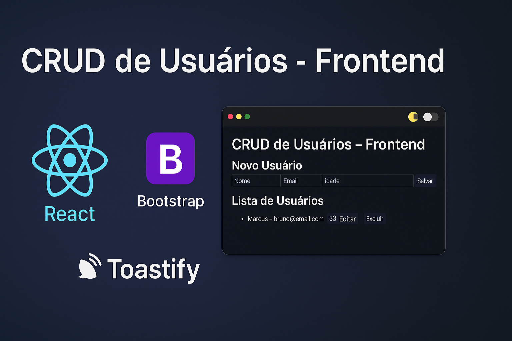

<h1 align="center">🌐 CRUD de Usuários - Frontend</h1>

<p align="center">
  
</p>

<p align="center">
  Frontend desenvolvido em <strong>React</strong>, consumindo a API do projeto <strong>CRUD de Usuários</strong> 
  hospedado no <strong>Render</strong>.  
  O projeto inclui <strong>Bootstrap</strong> para estilização, <strong>React Toastify</strong> para notificações 
  e suporte a <strong>Dark Mode persistente</strong>.
</p>

---

## 🚀 Deploy
🔗 **Acesse aqui:** [CRUD de Usuários - Frontend](https://SEU-LINK-VERCEL.vercel.app)  
*(Substitua pelo link gerado no Vercel)*

---

## 🛠️ Tecnologias Utilizadas

- [React](https://react.dev/) (Frontend)
- [Bootstrap](https://getbootstrap.com/) (Estilização responsiva)
- [React Toastify](https://fkhadra.github.io/react-toastify/introduction) (Notificações)
- [Axios](https://axios-http.com/) (Consumo de API)
- [LocalStorage](https://developer.mozilla.org/pt-BR/docs/Web/API/Window/localStorage) (Persistência do Dark Mode)
- [Render](https://render.com/) (Backend hospedado)
- [Vercel](https://vercel.com/) (Frontend hospedado)

---

## 📦 Como Rodar Localmente

```bash
# 1. Clone este repositório
git clone https://github.com/Marcusdba/crud-frontend.git

# 2. Entre na pasta
cd crud-frontend

# 3. Instale as dependências
npm install

# 4. Inicie o servidor local
npm start
